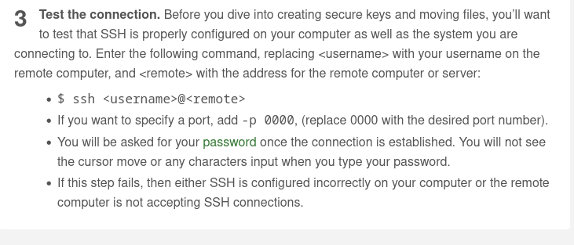
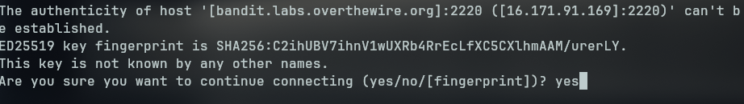

# Bandit Level 0 → Level 1

This level serves as a basic introduction to SSH and the command line. While it's categorized as simple, it can be a bit tricky if you're new to these tools—as I was when I first tried it.

---
### 🔧 Getting Started

Most operating systems come with SSH pre-installed. To begin, open your terminal (Linux/macOS) or PowerShell (Windows).

The challenge provides a link to a WikiHow article under the *Helpful Reading Material* section. Visiting that page gives us the foundational steps to connect to a remote server via SSH:




From the challenge description, we are given the following connection details:

- **Host (remote):** `bandit.labs.overthewire.org`  
- **Username:** `bandit0`  
- **Port:** `2220`  
- **Password:** `bandit0`  

---

### 🔑 Logging In via SSH

To connect to the server, we use the following command:

```bash
ssh bandit0@bandit.labs.overthewire.org -p 2220 
```

  
When prompted with a security warning about the host authenticity, choose **Yes**. This is expected when connecting for the first time.

Then enter the password: `bandit0`
**Note:** When typing the password, nothing will appear in the terminal. This is a common security feature in Unix-based systems.

Once entered, you should have access to a remote shell as the `bandit0` user.

### 🎯 Finding the Flag

To proceed to the next level, we need to locate the flag stored in a file.

One of the recommended commands listed on the challenge page is:
```bash
ls
```
Running this lists the directory contents. You should see a file named:
```bash 
readme
```
To display its contents, use:
```bash
cat readme
```
This will print the flag on the screen. It also serves as the **password for the next level *(`bandit1`)*.

### 🏁Flag: `ZjLjTmM6FvvyRnrb2rfNWOZOTa6ip5If`

