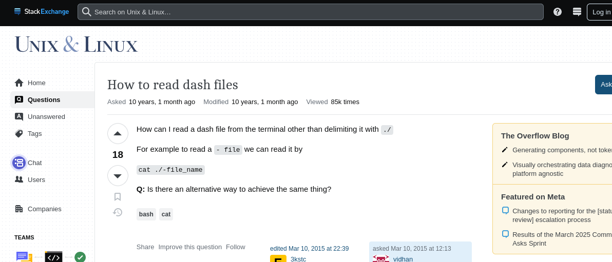

# Bandit 1 -> 2

 This level is another beginner-friendly step meant to get us more comfortable with the Linux terminal. It introduces a small but important concept: filenames that start with a dash (-).

--- 

### 🔧 Setup
We already know the following challenge details:
- **Host(remote):** bandit.labs.overthewire.org
- **Port:** 2220
- **Username:** bandit1
- **Password:** ZjLjTmM6FvvyRnrb2rfNWOZOTa6ip5If

---

### 🔑 Logging in via SSH
- Using the above details we can connect to the machine with the following command
    ```bash
    sshpass -p "ZjLjTmM6FvvyRnrb2rfNWOZOTa6ip5If" ssh bandit1@bandit.labs.overthewire.org -p2220
    ```

---

### 🎯 Finding the Flag

After connecting to the server, we can run a basic command like ls to check what's in the current directory. You'll see a file named -.

At first, you might try to read it with cat -, but that doesn’t work as expected. In Bash, the dash (-) is usually used to indicate command-line options, not filenames — so the terminal gets confused.

I didn’t know how to handle this at first either, so I did what most of us do — googled it. A quick search brought up some helpful explanations:


What we learn is that we can access the file by being more specific with the path:
```bash 
cat ./-
```
Here’s what that means:
    * . refers to the current directory

    * ./- tells the shell exactly where to find the file, avoiding any confusion with options

It’s a small trick, but a useful one — especially when you start dealing with oddly-named files in the wild.
Aaaand yep we get the flag/pass we need.

### 🏁 Flag: `263JGJPfgU6LtdEvgfWU1XP5yac29mFx`
