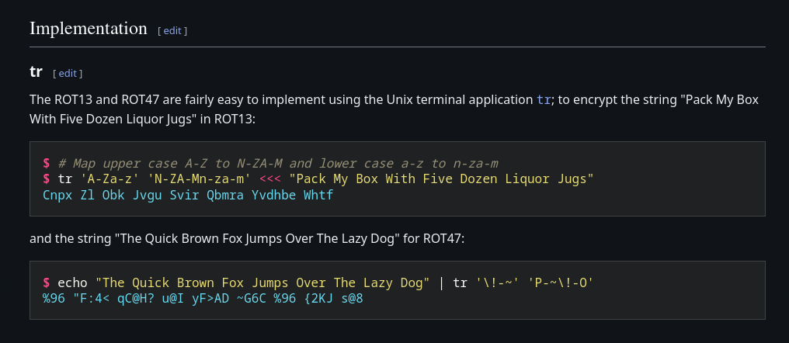

# Bandit 10 -> 11

We get introduced to ROT13 Cipher in this level! 
--- 

### 🔧 Setup
We already know the following challenge details:
- **Host(remote):** bandit.labs.overthewire.org
- **Port:** 2220
- **Username:** bandit11
- **Password:** dtR173fZKb0RRsDFSGsg2RWnpNVj3qRr

### 🔑 Logging in via SSH

- Using the above details we can log in using the following command
    ```bash
    sshpass -p "dtR173fZKb0RRsDFSGsg2RWnpNVj3qRr" ssh bandit11@bandit.labs.overthewire.org -p 2220
    ```

---

### 🎯 Finding the Flag

This was another fun level as we step into the world of cryptography.
- ROT13 is a cipher based on Ceasar Cipher where we shift the letters by a fixed number, which for ROT13 is `13`
- In this level we can use `tr` command and you can just look up how to on the wikipedia page of ROT13
  


- So to get the flag we simply run the simple simple following command:
```bash
cat data.txt | tr 'A-Za-z' 'N-ZA-Mn-za-m'
```

- And so we should get the flag

### 🏁 Flag: `7x16WNeHIi5YkIhWsfFIqoognUTyj9Q4`
