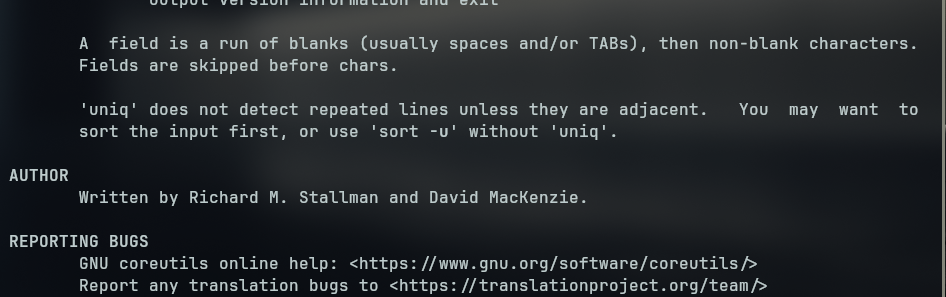

# Bandit 8 -> 9

In this level we get introduced to more commands like `uniq` , `sort` 

--- 

### 🔧 Setup
We already know the following challenge details:
- **Host(remote):** bandit.labs.overthewire.org
- **Port:** 2220
- **Username:** bandit8
- **Password:** dfwvzFQi4mU0wfNbFOe9RoWskMLg7eEc

### 🔑 Logging in via SSH

- Using the above details we can log in using the following command
    ```bash
    sshpass -p "dfwvzFQi4mU0wfNbFOe9RoWskMLg7eEc" ssh bandit8@bandit.labs.overthewire.org -p 2220
    ```

---

### 🎯 Finding the Flag

This was a really good one it had me reading through the man pages a bit.

- We start off by logging into the ssh session and we see the `data.txt` file again.
- Now the file is filled with text that looks like our passwords. And we have to print out the only line that comes in only once.
- To get the pass we can do the following command:
```bash
cat data.txt | sort | uniq -u 
```
- Now when we just execute `cat data.txt | uniq -u` it doesn't really work because...
    We can read it in man page of `uniq`
    
    

- Anyways thats why. So we can `sort` the data first and then use the `uniq` command.
- And so we should get the flag.

### 🏁 Flag: `4CKMh1JI91bUIZZPXDqGanal4xvAg0JM` 
