## Scope
```bash
https://zircon.ctfio.com
```

## Enumeration
We can use ffuf or subfinder for this.
    - Now ffuf is a "fuzzing" tool. I believe it basically sends requests to the list of url + wordlists we provide.

### Subdirectories
Lets first try finding subdirectories using subfinder.
```bash
ffuf -w /usr/share/SecLists/Discovery/Web-Content/directory-list-1.0.txt:FUZZ -u https://knuth.ctfio.com/FUZZ -ic
```
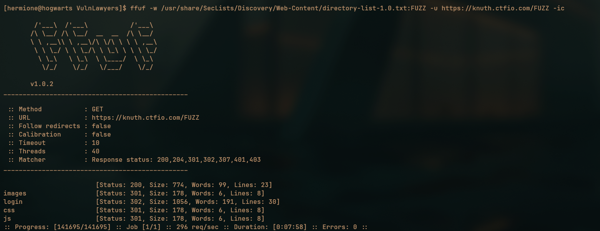

As you can see we dont find anything here. 
**EXCEPT THE LOGIN PAGE**

We can get the second flag if we just open the page in burp suite or caido.
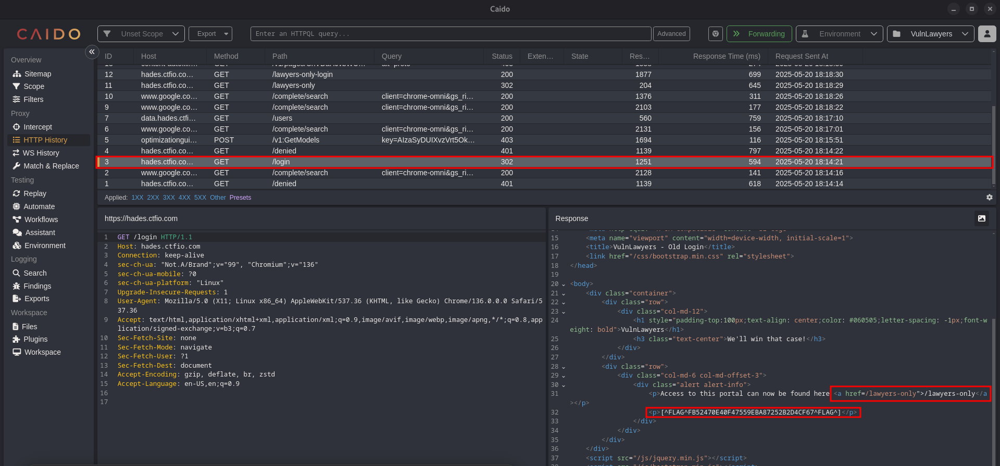

**NEW Endpoint** we find a new endpoint here aswell if we look closely. its `/lawyers-only`

### Virtual Hosts
Lets try finding Vhosts now. 
Vhost is short for virtual hosts and I learned what they from chatgpt
```bash
http://internal.vulnlawyers.hackinghub.io
http://admin.vulnlawyers.hackinghub.io
http://dev.vulnlawyers.hackinghub.
```
They all resolve to the same IP, but each has a *different virtual host configuration*, serving different content.

Which is very cool. Anyways we can run the following ffuf command to fuzz for Vhosts.
```bash
ffuf -u https://zircon.ctfio.com -w subdomains.txt -H "HOST: FUZZ.zircon.ctfio.com"
```
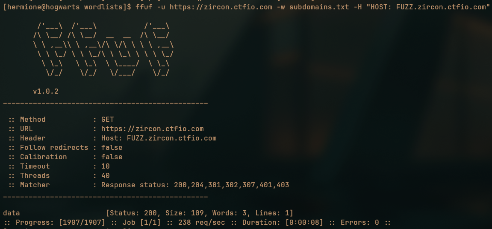

And we can see we found a `data` vhost and we can visit `https://data.zircon.ctfio.com` to get the first flag.
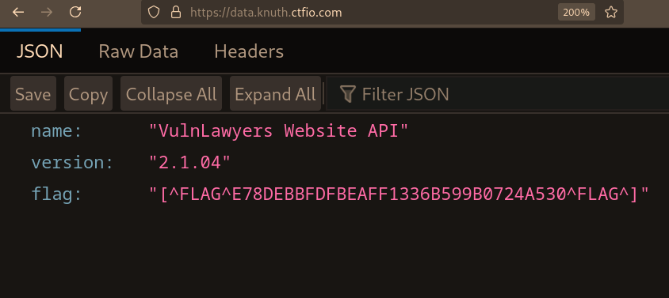

### New Endpoint `data.zircon.ctfio.com`
Now we can `enumerate` this new endpoint so we will look for more subdirectories
On running the following command we can find this webpage:
```bash
ffuf -w wordlists/subdomains.txt:FUZZ -u https://data.zircon.ctfio.com/FUZZ
```

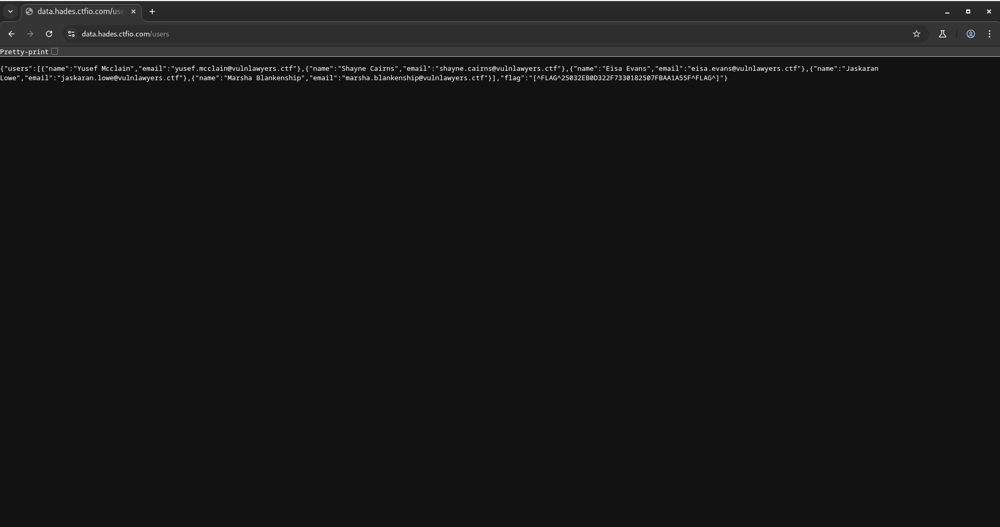

Here we find the list of email id's which will be used to bruteforce the login page we found.
We can copy and paste it into a new file called emails.json and then edit it a bit so its just emails.
```bash
jq ".users[].email" | cut -d '"' -f 2 > emailsextracted.txt
```

### New Endpoint `https://hades.ctfio.com/lawyers-only`

And we can now visit the new endpoint. We will find a login page we can go through some tests for like: 
- SQL Injections
- NoSQL Injections 
- Password Spraying

And the last one works brute forcing as there is no rate limiting. 

- Anyways we send a dummy request login request first. 
- We send that request to the automater.
- Then we select the email field and password field as the place holder 
- We can use the emailsextracted.txt here as a payload for the email field and already given passwords.txt

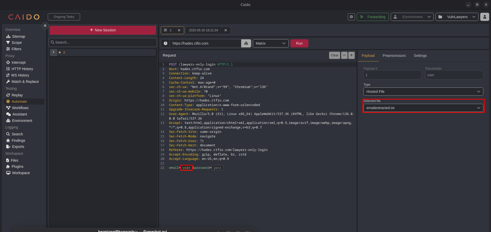
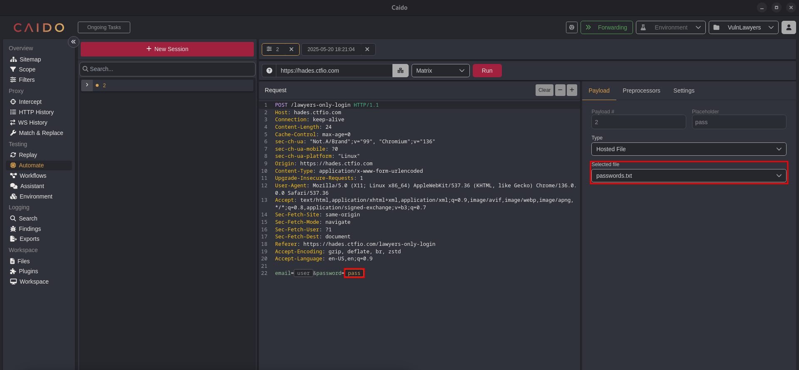
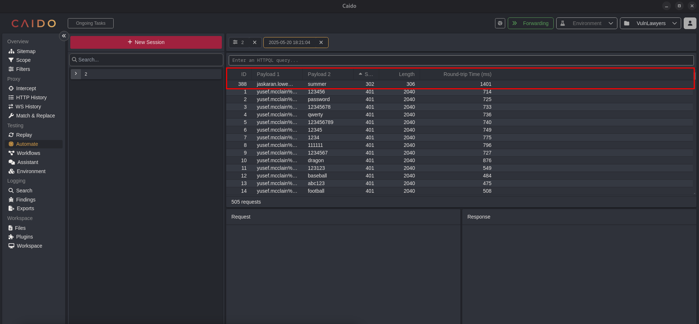

- We will find this vulnerable account
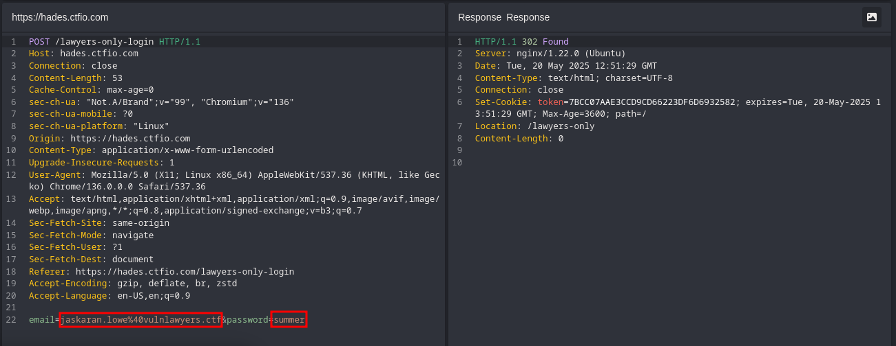

- And after logging in we will get our 4th flag
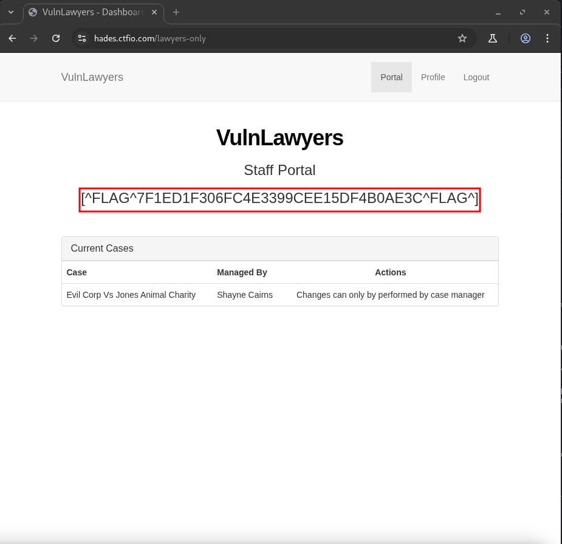

### New Web Functionality

We can see in the profile section that we can change our username. It doesnt work for us but we can see the request in caido
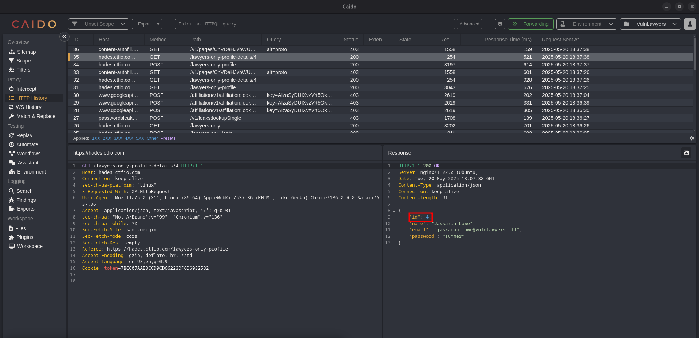
We can see its a very common example of an IDOR vulnerability.

- If we fiddle around with the id number we can find the credentials of Shayne Cairns who is the case manager.
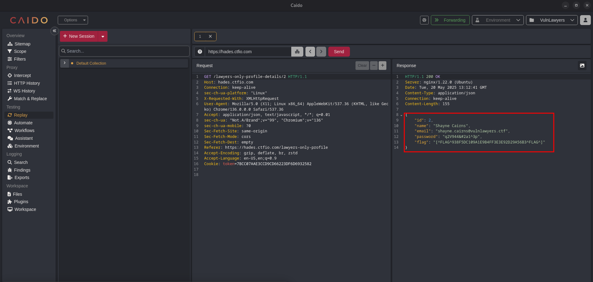
We also get the **Fifth Flag** here

Now the to get the last flag we just have to log back in as Shayne Cairns and delete the Case
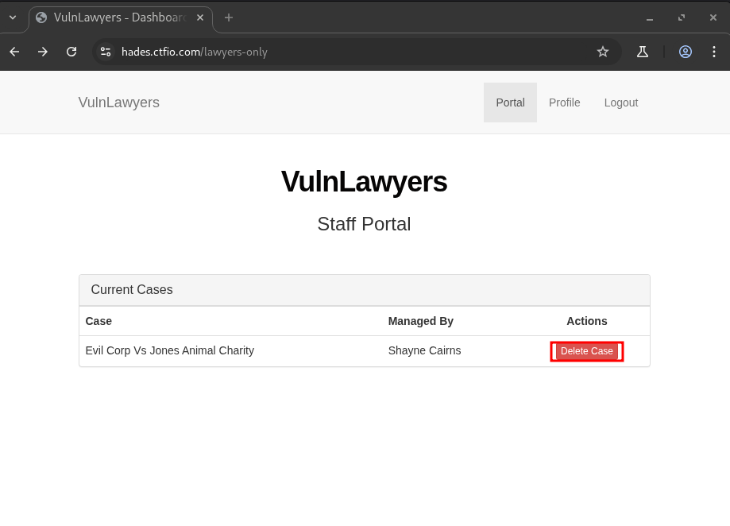

And to get the flag we just have to delete the case the Last Functionality of the Web APP
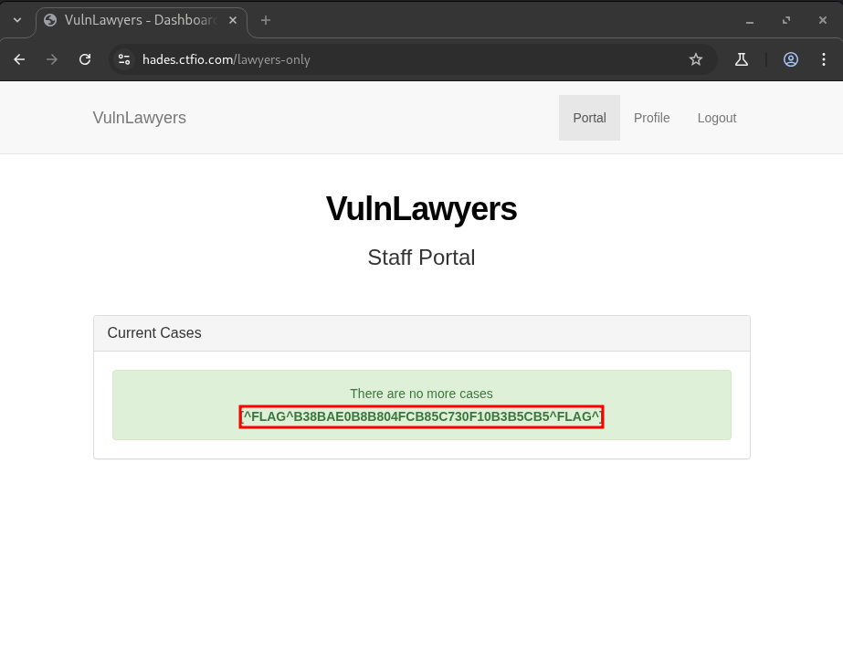
